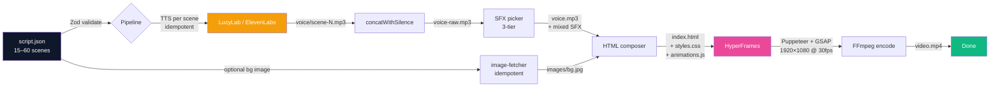

<a id="top"></a>

<div align="center">


# 🎬 The Dead Giants

### Cinematic 16:9 documentaries about brand history — from one script.json to a 1920×1080 MP4

**One command. No manual editing. 8–15 minute YouTube-ready documentaries.**

[](https://github.com/sozinytbno1-sketch/the-dead-giants/stargazers)
[](LICENSE)
[](https://nodejs.org)
[](https://www.typescriptlang.org/)
[](https://github.com/sozinytbno1-sketch/the-dead-giants/actions/workflows/test.yml)
[](https://github.com/sozinytbno1-sketch/the-dead-giants/actions/workflows/typecheck.yml)

[**🇬🇧 English**](README.md) · [**🇻🇳 Tiếng Việt**](README.vi.md) · [**🚀 Quick Start**](#-quick-start) · [**❓ FAQ**](#-faq)

</div>

---

## 🎯 What is this?

**The Dead Giants** is a programmatic documentary pipeline. Feed it a structured script (`script.json`) about a fallen-or-faded brand — McDonald's, Nokia, Kodak, Yahoo!, Toys R Us — and it produces a finished **1920×1080**, **8–15 minute** documentary video with voiceover, transitions, sound design and a YouTube end-screen, ready to upload to `@thedeadgiantsHQ` (or any channel you point it at).

It's a fork/rebuild of [`Auto News Video`](https://github.com/hoquanghai/Auto-Create-Video) — re-aimed from 60-second 9:16 Vietnamese tech news at long-form 16:9 cinematic documentary.

| | Manual workflow | The Dead Giants |
|---|---|---|
| ⏱️ Time per 10-min episode | 8–20 hours | **~10–15 minutes** |
| 🎓 Skill required | Documentary editor | **Script writer + JSON** |
| 🎯 Look | Varies | **Cinematic, every time** |
| 💰 Cost per episode | $200–800 (freelancer) | **~$0.30–1.00 (TTS API)** |
| 🇻🇳 Vietnamese voice | Hard to source | **Built-in (LucyLab cloning)** |

---

## 🚀 Quick Start

```bash
# 1. Clone & install
git clone https://github.com/sozinytbno1-sketch/the-dead-giants.git
cd the-dead-giants
npm install

# 2. Install ffmpeg (audio concat / mux)
sudo apt-get install -y ffmpeg          # Ubuntu/Debian
# brew install ffmpeg                   # macOS
# winget install Gyan.FFmpeg            # Windows

# 3. Configure TTS + YouTube branding
cp .env.example .env.local
# → set TTS_PROVIDER + key (LucyLab or ElevenLabs)
# → set YOUTUBE_CHANNEL_NAME / YOUTUBE_HANDLE / YOUTUBE_SUBSCRIBERS
```

Then choose your path:

**Path A — Hand-write the script (no AI needed):**

```bash
# Edit your script.json by hand following src/render/script-schema.ts
mkdir -p output/mcdonalds && $EDITOR output/mcdonalds/script.json
npm run pipeline -- output/mcdonalds/script.json
```

**Path B — Generate with Claude Code:**

```
/create-news-video https://en.wikipedia.org/wiki/History_of_McDonald%27s
```

Either way, after a few minutes you get `output/<slug>/video.mp4` — **1920×1080**, 8–15 minutes, with the YouTube end-screen card on the final scene.

> 💡 The pipeline is **idempotent**: if `output/<slug>/voice/scene-X.mp3` already exists it skips TTS, and if `output/<slug>/images/bg.jpg` exists it skips the image download. Drop in your own voiceover or background art and the pipeline will respect it.

---

## ✨ Features

<table>
<tr>
<td width="33%" align="center">
<h3>🎨 11 Documentary Templates</h3>
<sub>hook · comparison · stat-hero · feature-list · callout · outro<br/><b>+ timeline · quote-card · chapter-title · brand-logo · fact-card</b></sub>
</td>
<td width="33%" align="center">
<h3>📺 YouTube-Native</h3>
<sub>1920×1080 @ 30fps + animated end-screen card (Subscribe button, Watch Next, channel logo)</sub>
</td>
<td width="33%" align="center">
<h3>🤖 Bring Your Own Script</h3>
<sub>Hand-write JSON, or use the rewritten Claude Code skill <code>/create-news-video</code> for Wikipedia/article input</sub>
</td>
</tr>
<tr>
<td width="33%" align="center">
<h3>🎬 Cinematic by Default</h3>
<sub>Documentary-dark theme + grain texture + Cinzel/Playfair display fonts + GSAP timelines per template</sub>
</td>
<td width="33%" align="center">
<h3>🔊 3-Tier SFX Selector</h3>
<sub>Per-scene override → semantic match on voiceText → template default category, deterministic per scene id</sub>
</td>
<td width="33%" align="center">
<h3>🧪 Production Ready</h3>
<sub>57 unit tests, Zod discriminated-union schema, full TypeScript ESM, GitHub Actions CI</sub>
</td>
</tr>
<tr>
<td width="33%" align="center">
<h3>♻️ Idempotent Pipeline</h3>
<sub>Pre-place <code>voice/scene-X.mp3</code> → skip TTS<br/>Pre-place <code>images/bg.jpg</code> → skip download</sub>
</td>
<td width="33%" align="center">
<h3>🎤 Multi-TTS</h3>
<sub>LucyLab (Vietnamese cloning + free SRT) or ElevenLabs (30+ languages)</sub>
</td>
<td width="33%" align="center">
<h3>📐 Long-form by Design</h3>
<sub>Schema enforces 15–60 scenes, pipeline targets 480–900 s — no editing the validator to fit a longer doc</sub>
</td>
</tr>
</table>

---

## 🧠 How It Works



The pipeline cleanly separates **content** (the script.json — author or LLM) from **production** (Node/TS/FFmpeg renders pixels deterministically — same script → identical frames).

---

## 🛠️ Tech Stack

| Layer | Technology |
|---|---|
| **Runtime** | Node.js ≥ 22, TypeScript 5+, ESM |
| **Render engine** | [HyperFrames](https://hyperframes.heygen.com) (Puppeteer + GSAP + FFmpeg) |
| **TTS providers** | [LucyLab.io](https://lucylab.io) (Vietnamese cloning, SRT included) or [ElevenLabs](https://elevenlabs.io) (30+ languages) |
| **Schema validation** | [Zod](https://zod.dev) v4 discriminated unions across 11 templates, 15–60 scene window |
| **HTTP** | axios + nock (test mocking) |
| **Concurrency** | [p-limit](https://github.com/sindresorhus/p-limit) (per-provider TTS limits) |
| **Testing** | [Vitest](https://vitest.dev) — ESM-native |
| **Audio processing** | FFmpeg + ffprobe (mix, concat with silence) |
| **AI orchestration** *(optional)* | [Claude Code](https://docs.claude.com/en/docs/claude-code/overview) skill — see [`SKILL.md`](.claude/skills/create-news-video/SKILL.md) |
| **Fonts** | Inter + Anton + Bebas Neue + Cinzel + Playfair Display |

---

## 🔧 Configuration

`.env.local`:

```env
# ── TTS provider ───────────────────────────────────────────────
TTS_PROVIDER=lucylab           # or "elevenlabs"

# LucyLab (Vietnamese)
VIETNAMESE_API_KEY=sk_live_xxxxxxxxxxxx
VIETNAMESE_VOICEID=22charvoiceiduuidhere

# ElevenLabs (30+ languages)
ELEVENLABS_API_KEY=sk_xxxxxxxxxxxxxxxxxxxxxxxxxxxxxxxx
ELEVENLABS_VOICE_ID=EXAVITQu4vr4xnSDxMaL
ELEVENLABS_MODEL_ID=eleven_multilingual_v2

# ── YouTube branding (replaces TikTok config from v1) ──────────
YOUTUBE_CHANNEL_NAME=The Dead Giants
YOUTUBE_HANDLE=@thedeadgiantsHQ
YOUTUBE_SUBSCRIBERS=10K subscribers
YOUTUBE_LOGO_URL=https://example.com/your-logo.png   # optional

# ── Pipeline tuning ────────────────────────────────────────────
TTS_CONCURRENCY=1              # 1 for LucyLab, can raise for ElevenLabs
```

---

## 🎬 Usage

### Option 1 — Hand-written `script.json` (zero AI)

```jsonc
{
  "metadata": {
    "title": "The Rise and Fall of McDonald's",
    "subtitle": "How a burger franchise became real estate",
    "theme": "documentary-dark",
    "source": { "url": "manual", "domain": "manual" }
  },
  "scenes": [
    { "id": "hook", "type": "hook", "voiceText": "...", "templateData": { "template": "hook", "headline": "...", "kenBurns": "zoom-in", "bgSrc": "$source.image" } },
    { "id": "ch1", "type": "body", "voiceText": "...", "templateData": { "template": "chapter-title", "chapterNumber": 1, "title": "Origins", "subtitle": "1940 — San Bernardino" } },
    { "id": "tl1", "type": "body", "voiceText": "...", "templateData": { "template": "timeline", "events": [
      { "year": "1940", "text": "..." }, { "year": "1955", "text": "..." }
    ]}},
    { "id": "q1",  "type": "body", "voiceText": "...", "templateData": { "template": "quote-card", "quote": "...", "author": "Ray Kroc", "role": "Founder" } },
    /* ...15–60 scenes total... */
    { "id": "outro", "type": "outro", "voiceText": "...", "templateData": { "template": "outro", "ctaTop": "Subscribe", "channelName": "The Dead Giants", "source": "thedeadgiantsHQ" } }
  ]
}
```

```bash
npm run pipeline -- output/mcdonalds/script.json
```

A full annotated example lives at [`tests/fixtures/sample-doc-with-image.json`](tests/fixtures/sample-doc-with-image.json) — every one of the 11 templates appears at least once.

### Option 2 — Inside Claude Code

```
/create-news-video https://en.wikipedia.org/wiki/History_of_McDonald%27s
/create-news-video research/kodak.txt
```

The skill at [`.claude/skills/create-news-video/SKILL.md`](.claude/skills/create-news-video/SKILL.md) is rewritten for documentary tone — it generates 1500–2500 words across the canonical structure: **Hook → Origins → Peak → Crisis → Hidden Truth → Lesson → Outro**, weighted toward `quote-card`, `timeline`, `chapter-title`.

### Option 3 — Re-render visuals only

After voice files exist, you can iterate on visuals without spending TTS budget:

```bash
npm run rerender -- output/mcdonalds
```

---

## 📁 Output Structure

```
output/<slug>/
├── script.json                # Input
├── voice/
│   ├── scene-hook.mp3         # Per-scene TTS — IDEMPOTENT, drop in your own to skip API
│   ├── scene-hook.srt         # SRT subtitles (LucyLab only)
│   ├── scene-ch1.mp3
│   └── ...
├── images/
│   └── bg.jpg                 # og:image — IDEMPOTENT, drop in your own to skip download
├── voice-raw.mp3              # Concatenated voices, no SFX
├── voice.mp3                  # Final audio with SFX mixed in
├── youtube-logo.png           # Channel logo (downloaded or copied)
├── index.html                 # HyperFrames composition
├── styles.css                 # Self-contained, includes documentary-dark theme
├── animations.js              # GSAP timeline (per-template entry/exit)
├── hyperframes.json           # Manifest
└── video.mp4                  # 🎉 Final — 1920×1080 @ 30fps
```

---

## 🎨 Templates

11 templates total — the original 6 (kept and ported to landscape) plus 5 new documentary ones:

| Template | Use it for | Key fields |
|---|---|---|
| `hook` | Cold-open headline (3–5 s) | `headline`, `subhead`, `bgSrc`, `kenBurns` |
| `comparison` | Side-by-side "X vs Y" stat cards | `left`, `right`, `right.winner` |
| `stat-hero` | Single dominant number | `value`, `label`, `context` |
| `feature-list` | Up to 4 bullets | `title`, `bullets[]` |
| `callout` | Pull-out warning / tag-line | `tag`, `statement` |
| `outro` | Final scene with subscribe CTA | `ctaTop`, `channelName`, `source` |
| **`timeline`** | 2–6 dated events (left→right reveal) | `events[].year`, `events[].text` |
| **`quote-card`** | Pull quote in serif | `quote`, `author`, `role` |
| **`chapter-title`** | "Chapter 02 — The Fall" | `chapterNumber`, `title`, `subtitle` |
| **`brand-logo`** | Brand identity card over bg | `brandName`, `founded`, `country`, `bgSrc` |
| **`fact-card`** | "DID YOU KNOW?" surprise | `label`, `fact` |

The CSS lives in [`src/render/templates/styles.css`](src/render/templates/styles.css) and is fully self-contained (no external CSS framework). The new `documentary-dark` theme uses cinematic CSS tokens:

```css
--doc-ink:   #0a0a0a   /* near-black background */
--doc-cream: #f5f0e1   /* off-white body text */
--doc-gold:  #c9a961   /* accent / highlights */
--doc-amber: #e0a040   /* secondary accent */
--doc-rust:  #a94a3a   /* warning / crisis tone */
```

---

## 🔊 Sound Effects

The 3-tier SFX picker in [`src/assets/sfx-selector.ts`](src/assets/sfx-selector.ts) chooses in this order:

1. **Explicit `scene.sfx`** override — `"none"` disables SFX for that scene.
2. **Semantic match** on `voiceText` keywords (Vietnamese + English): `cảnh báo|warning|risk` → `alert`, `kỷ lục|record|breakthrough` → `success`, `ra mắt|launch|reveal` → `reveal`, `thất bại|fail|crash` → `fail`, `đỉnh cao|legendary|epic` → `cinematic`.
3. **Template default category** with fallback chain.

Default category map for the 11 templates:

| Template | Primary → fallback |
|---|---|
| `hook` | `transition` → `cinematic` |
| `comparison` | `transition` → `emphasis` |
| `stat-hero` | `emphasis` → `success` |
| `feature-list` | `transition` → `emphasis` |
| `callout` | `alert` → `drumroll` |
| `outro` | `outro` → `success` |
| **`timeline`** | `cinematic` → `reveal` |
| **`quote-card`** | `cinematic` → `emphasis` |
| **`chapter-title`** | `cinematic` → `drumroll` |
| **`brand-logo`** | `reveal` → `cinematic` |
| **`fact-card`** | `emphasis` → `success` |

Within a category, files are picked **deterministically** by hashing the scene id (same script → same SFX, but different scenes get different files).

---

## 🧪 Testing

```bash
npm test                 # 57 unit tests (~5s)
npm run typecheck        # tsc --noEmit
```

Tests cover Zod schema validation across all 11 templates, the 15–60 scene window, both TTS clients (with `nock` HTTP mocking — no real API calls), audio tools (with fixture mp3 sine waves), the 3-tier SFX selector, the image fetcher's idempotency, and HTML composer output (1920×1080 dimensions, YouTube branding, no TikTok artefacts).

CI runs the same tests on every push (see badges at top).

---

## ❓ FAQ

<details>
<summary><b>Can I make episodes about brands that aren't dead?</b></summary>

Yes — the channel name is just `YOUTUBE_CHANNEL_NAME`. Set it to whatever your channel is called. The pipeline doesn't care if the brand is alive — set the documentary tone in your script.json. The "documentary-dark" theme works equally well for "rise of" stories as for "fall of" stories.
</details>

<details>
<summary><b>How do I make episodes longer than 15 minutes?</b></summary>

Edit the bounds in [`src/pipeline.ts`](src/pipeline.ts):

```ts
const DURATION_MIN_SEC = 480;   // 8 minutes
const DURATION_MAX_SEC = 900;   // 15 minutes
```

…and the scene-count bounds in [`src/render/script-schema.ts`](src/render/script-schema.ts):

```ts
.min(15).max(60)
```

The defaults are calibrated for what feels like a single-sitting YouTube documentary. Going longer is mostly fine — pacing concerns are on you, not the pipeline.
</details>

<details>
<summary><b>Can I use a language other than Vietnamese?</b></summary>

Yes. Switch `TTS_PROVIDER=elevenlabs` — ElevenLabs supports 30+ languages. The `voiceText` rules (spelling out numbers, brand names) still apply. The Claude Code skill is currently optimised for Vietnamese; for English/Chinese/Japanese scripts, edit the prompts in [`SKILL.md`](.claude/skills/create-news-video/SKILL.md) or write the JSON by hand.
</details>

<details>
<summary><b>How much does an episode cost?</b></summary>

For a 10-minute episode (~1500–2000 spoken words):

- LucyLab: ~$0.20–0.40
- ElevenLabs: ~$0.50–1.00
- Claude API (script generation, optional): ~$0.30–0.50

So end-to-end: roughly **$0.30–1.50 per episode** depending on TTS choice and whether you use Claude Code.
</details>

<details>
<summary><b>Can I run this without Claude Code?</b></summary>

Yes — that's Path A in [Quick Start](#-quick-start). Hand-write `script.json` against the schema in [`src/render/script-schema.ts`](src/render/script-schema.ts) and run `npm run pipeline -- output/<slug>/script.json`. The Claude Code skill is just a script-generation convenience; the pipeline itself is pure Node.js.
</details>

<details>
<summary><b>The TTS is mispronouncing numbers / brand names. How do I fix it?</b></summary>

Vietnamese TTS reads digits literally — spell them out in `voiceText` while keeping the digit form on screen in `templateData`:

| In `voiceText` (TTS-friendly) | On screen (`templateData`) |
|---|---|
| `năm một chín năm lăm` *or* `năm 1955` | `1955` |
| `một phẩy năm tỷ` | `$1.5B` |
| `tám mươi phần trăm` | `80%` |
| English brand names — keep as-is | `McDonald's`, `Nokia`, `Kodak` |

Never put `$ % → &` in `voiceText`. The `SKILL.md` rules cover the full phonetic ruleset.
</details>

<details>
<summary><b>How do I supply my own voiceover or background image?</b></summary>

The pipeline checks before each external call:

```
output/<slug>/voice/scene-hook.mp3   ← if exists, skip TTS for this scene
output/<slug>/images/bg.jpg          ← if exists, skip og:image download
```

So you can:

1. Create the output directory + script.json
2. Drop your own mp3s into `voice/` (named `scene-<id>.mp3`) and/or your own image into `images/bg.jpg`
3. Run `npm run pipeline -- output/<slug>/script.json` — it'll synthesise only the missing scenes, fetch only the missing image, then continue.

This is also how `npm run rerender` works — voice files are reused, only HTML/animations/MP4 get rebuilt.
</details>

<details>
<summary><b>Why HyperFrames instead of Remotion?</b></summary>

HyperFrames is a HeyGen-built HTML-to-video framework. We picked it because it's AI-friendly (Claude can author the HTML directly), comes with a registry of pre-built blocks, and has GSAP integrated. Remotion is also excellent — different tools, different jobs. The architecture (deterministic timeline, declarative scenes) is similar enough that porting would mostly be a rendering-layer swap.
</details>

---

## 🐛 Troubleshooting

| Error | Fix |
|---|---|
| `Missing VIETNAMESE_API_KEY` / `Missing ELEVENLABS_API_KEY` | Check `.env.local` exists and `TTS_PROVIDER` matches the keys you have |
| `spawn ffmpeg ENOENT` | Install ffmpeg (`sudo apt install ffmpeg` / `brew install ffmpeg` / `winget install Gyan.FFmpeg`) |
| `Total duration outside [480, 900]s` | Pipeline only **warns** — re-trigger the skill or hand-edit `script.json` to lengthen / shorten text |
| `scenes: array must contain at least 15 elements` | The schema enforces 15–60 scenes for a documentary. Add scenes (chapter splits, timeline beats, fact-cards) until you cross 15 |
| `LucyLab polling timeout` | Raise `LUCYLAB_POLL_TIMEOUT_MS` in `.env.local` (default 120000ms) |
| `hyperframes render failed` | Ensure Puppeteer can download Chrome on first run; behind a corporate proxy, set `PUPPETEER_DOWNLOAD_HOST` |

---

## 📜 License

[MIT](LICENSE) — fork freely, contribute back if you like.

---

## 🙏 Acknowledgements

- [HyperFrames by HeyGen](https://hyperframes.heygen.com) — the HTML-to-video engine
- [LucyLab.io](https://lucylab.io) — Vietnamese voice cloning
- [ElevenLabs](https://elevenlabs.io) — multilingual TTS
- [Anthropic Claude](https://www.anthropic.com/claude) — script generation via Claude Code
- Original [Auto News Video](https://github.com/hoquanghai/Auto-Create-Video) by [Ho Quang Hai](https://github.com/hoquanghai) — the codebase this rebuild is based on

<div align="center">

**[⬆ Back to top](#top)**

</div>
