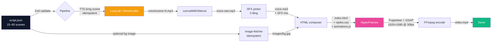

<a id="top"></a>

<div align="center">


# 🎬 The Dead Giants

### Phim tài liệu cinematic 16:9 về lịch sử thương hiệu — từ một file `script.json` ra MP4 1920×1080

**Một câu lệnh. Không cần edit thủ công. Tài liệu YouTube 8–15 phút.**

[](https://github.com/sozinytbno1-sketch/the-dead-giants/stargazers)
[](LICENSE)
[](https://nodejs.org)
[](https://www.typescriptlang.org/)
[](https://github.com/sozinytbno1-sketch/the-dead-giants/actions/workflows/test.yml)
[](https://github.com/sozinytbno1-sketch/the-dead-giants/actions/workflows/typecheck.yml)

[**🇬🇧 English**](README.md) · [**🇻🇳 Tiếng Việt**](README.vi.md) · [**🚀 Bắt đầu nhanh**](#-bắt-đầu-nhanh) · [**❓ FAQ**](#-faq)

</div>

---

## 🎯 Đây là gì?

**The Dead Giants** là pipeline sinh phim tài liệu tự động. Đưa cho nó một `script.json` về một thương hiệu đã gục ngã hoặc nhạt phai — McDonald's, Nokia, Kodak, Yahoo!, Toys R Us — và nó trả lại video tài liệu **1920×1080**, **8–15 phút**, đầy đủ voiceover, transition, sound design và YouTube end-screen, sẵn sàng upload lên `@thedeadgiantsHQ` (hoặc kênh nào bạn cấu hình).

Đây là bản fork/build lại từ [`Auto News Video`](https://github.com/hoquanghai/Auto-Create-Video) — chuyển hướng từ video tin công nghệ tiếng Việt 60 giây 9:16 sang phim tài liệu cinematic dài 16:9.

| | Cách thủ công | The Dead Giants |
|---|---|---|
| ⏱️ Thời gian / tập 10 phút | 8–20 tiếng | **~10–15 phút** |
| 🎓 Kỹ năng cần | Editor phim tài liệu | **Người viết kịch bản + JSON** |
| 🎯 Phong cách | Phụ thuộc người làm | **Cinematic mọi tập** |
| 💰 Chi phí / tập | $200–800 (freelancer) | **~$0.30–1.00 (TTS API)** |
| 🇻🇳 Giọng tiếng Việt | Khó tìm | **Sẵn (LucyLab cloning)** |

---

## 🚀 Bắt đầu nhanh

```bash
# 1. Clone & cài deps
git clone https://github.com/sozinytbno1-sketch/the-dead-giants.git
cd the-dead-giants
npm install

# 2. Cài ffmpeg (cần cho concat / mux audio)
sudo apt-get install -y ffmpeg          # Ubuntu/Debian
# brew install ffmpeg                   # macOS
# winget install Gyan.FFmpeg            # Windows

# 3. Cấu hình TTS + branding YouTube
cp .env.example .env.local
# → set TTS_PROVIDER + key (LucyLab hoặc ElevenLabs)
# → set YOUTUBE_CHANNEL_NAME / YOUTUBE_HANDLE / YOUTUBE_SUBSCRIBERS
```

Sau đó chọn 1 trong 2 cách:

**Cách A — Tự viết script (không cần AI):**

```bash
# Tự viết script.json theo schema trong src/render/script-schema.ts
mkdir -p output/mcdonalds && $EDITOR output/mcdonalds/script.json
npm run pipeline -- output/mcdonalds/script.json
```

**Cách B — Sinh bằng Claude Code:**

```
/create-news-video https://en.wikipedia.org/wiki/History_of_McDonald%27s
```

Cả 2 cách: sau vài phút bạn có `output/<slug>/video.mp4` — **1920×1080**, 8–15 phút, có YouTube end-screen card ở scene cuối.

> 💡 Pipeline **idempotent**: nếu `output/<slug>/voice/scene-X.mp3` đã có sẵn thì pipeline skip TTS, nếu `output/<slug>/images/bg.jpg` đã có thì skip download. Cứ đặt voice / ảnh nền của bạn vào trước rồi chạy — pipeline tôn trọng file đã có.

---

## ✨ Tính năng

<table>
<tr>
<td width="33%" align="center">
<h3>🎨 11 template tài liệu</h3>
<sub>hook · comparison · stat-hero · feature-list · callout · outro<br/><b>+ timeline · quote-card · chapter-title · brand-logo · fact-card</b></sub>
</td>
<td width="33%" align="center">
<h3>📺 YouTube-Native</h3>
<sub>1920×1080 @ 30fps + animated end-screen card (Subscribe button, Watch Next, channel logo)</sub>
</td>
<td width="33%" align="center">
<h3>🤖 Tự viết hoặc dùng AI</h3>
<sub>Tự viết JSON, hoặc dùng Claude Code skill <code>/create-news-video</code> với input URL Wikipedia / file .txt</sub>
</td>
</tr>
<tr>
<td width="33%" align="center">
<h3>🎬 Cinematic mặc định</h3>
<sub>Theme documentary-dark + grain texture + font Cinzel/Playfair + GSAP timeline cho mỗi template</sub>
</td>
<td width="33%" align="center">
<h3>🔊 SFX selector 3 tầng</h3>
<sub>Per-scene override → semantic match trên voiceText → template default category, deterministic theo scene id</sub>
</td>
<td width="33%" align="center">
<h3>🧪 Production Ready</h3>
<sub>57 unit tests, Zod discriminated-union schema, full TypeScript ESM, GitHub Actions CI</sub>
</td>
</tr>
<tr>
<td width="33%" align="center">
<h3>♻️ Pipeline idempotent</h3>
<sub>Đặt sẵn <code>voice/scene-X.mp3</code> → skip TTS<br/>Đặt sẵn <code>images/bg.jpg</code> → skip download</sub>
</td>
<td width="33%" align="center">
<h3>🎤 Đa nhà cung cấp TTS</h3>
<sub>LucyLab (giọng Việt cloning + SRT free) hoặc ElevenLabs (30+ ngôn ngữ)</sub>
</td>
<td width="33%" align="center">
<h3>📐 Long-form từ thiết kế</h3>
<sub>Schema enforce 15–60 scenes, pipeline target 480–900 s — không cần sửa validator để fit doc dài</sub>
</td>
</tr>
</table>

---

## 🧠 Cách hoạt động



Pipeline tách bạch **content** (script.json — tự viết hoặc LLM) khỏi **production** (Node/TS/FFmpeg render pixel deterministic — cùng script → frames giống hệt).

---

## 🛠️ Công nghệ sử dụng

| Lớp | Công nghệ |
|---|---|
| **Runtime** | Node.js ≥ 22, TypeScript 5+, ESM |
| **Render engine** | [HyperFrames](https://hyperframes.heygen.com) (Puppeteer + GSAP + FFmpeg) |
| **TTS providers** | [LucyLab.io](https://lucylab.io) (Vietnamese cloning, có SRT) hoặc [ElevenLabs](https://elevenlabs.io) (30+ ngôn ngữ) |
| **Schema validation** | [Zod](https://zod.dev) v4 discriminated unions, 11 template, 15–60 scene |
| **HTTP** | axios + nock (test mocking) |
| **Concurrency** | [p-limit](https://github.com/sindresorhus/p-limit) (rate-limit TTS theo provider) |
| **Testing** | [Vitest](https://vitest.dev) — ESM-native |
| **Audio processing** | FFmpeg + ffprobe (mix, concat with silence) |
| **AI orchestration** *(tuỳ chọn)* | [Claude Code](https://docs.claude.com/en/docs/claude-code/overview) skill — xem [`SKILL.md`](.claude/skills/create-news-video/SKILL.md) |
| **Fonts** | Inter + Anton + Bebas Neue + Cinzel + Playfair Display |

---

## 🔧 Cấu hình

`.env.local`:

```env
# ── TTS provider ───────────────────────────────────────────────
TTS_PROVIDER=lucylab           # hoặc "elevenlabs"

# LucyLab (tiếng Việt)
VIETNAMESE_API_KEY=sk_live_xxxxxxxxxxxx
VIETNAMESE_VOICEID=22charvoiceiduuidhere

# ElevenLabs (30+ ngôn ngữ)
ELEVENLABS_API_KEY=sk_xxxxxxxxxxxxxxxxxxxxxxxxxxxxxxxx
ELEVENLABS_VOICE_ID=EXAVITQu4vr4xnSDxMaL
ELEVENLABS_MODEL_ID=eleven_multilingual_v2

# ── YouTube branding (thay TikTok config bản v1) ────────────────
YOUTUBE_CHANNEL_NAME=The Dead Giants
YOUTUBE_HANDLE=@thedeadgiantsHQ
YOUTUBE_SUBSCRIBERS=10K subscribers
YOUTUBE_LOGO_URL=https://example.com/your-logo.png   # optional

# ── Pipeline tuning ────────────────────────────────────────────
TTS_CONCURRENCY=1              # 1 cho LucyLab, có thể tăng cho ElevenLabs
```

---

## 🎬 Sử dụng

### Cách 1 — Tự viết `script.json` (không AI)

```jsonc
{
  "metadata": {
    "title": "The Rise and Fall of McDonald's",
    "subtitle": "How a burger franchise became real estate",
    "theme": "documentary-dark",
    "source": { "url": "manual", "domain": "manual" }
  },
  "scenes": [
    { "id": "hook", "type": "hook", "voiceText": "...", "templateData": { "template": "hook", "headline": "...", "kenBurns": "zoom-in", "bgSrc": "$source.image" } },
    { "id": "ch1", "type": "body", "voiceText": "...", "templateData": { "template": "chapter-title", "chapterNumber": 1, "title": "Khởi nguồn", "subtitle": "1940 — San Bernardino" } },
    { "id": "tl1", "type": "body", "voiceText": "...", "templateData": { "template": "timeline", "events": [
      { "year": "1940", "text": "..." }, { "year": "1955", "text": "..." }
    ]}},
    { "id": "q1",  "type": "body", "voiceText": "...", "templateData": { "template": "quote-card", "quote": "...", "author": "Ray Kroc", "role": "Founder" } },
    /* ...tổng 15–60 scenes... */
    { "id": "outro", "type": "outro", "voiceText": "...", "templateData": { "template": "outro", "ctaTop": "Subscribe", "channelName": "The Dead Giants", "source": "thedeadgiantsHQ" } }
  ]
}
```

```bash
npm run pipeline -- output/mcdonalds/script.json
```

Có example đầy đủ ở [`tests/fixtures/sample-doc-with-image.json`](tests/fixtures/sample-doc-with-image.json) — tất cả 11 template đều xuất hiện ít nhất 1 lần.

### Cách 2 — Trong Claude Code

```
/create-news-video https://en.wikipedia.org/wiki/History_of_McDonald%27s
/create-news-video research/kodak.txt
```

Skill ở [`.claude/skills/create-news-video/SKILL.md`](.claude/skills/create-news-video/SKILL.md) đã viết lại cho phong cách documentary — sinh kịch bản 1500–2500 từ theo cấu trúc chuẩn: **Hook → Bối cảnh → Đỉnh cao → Khủng hoảng → Bí mật → Bài học → Outro**, ưu tiên `quote-card`, `timeline`, `chapter-title`.

### Cách 3 — Re-render visual

Khi voice file đã có sẵn, có thể iterate visual mà không tốn TTS:

```bash
npm run rerender -- output/mcdonalds
```

---

## 📁 Cấu trúc output

```
output/<slug>/
├── script.json                # Input
├── voice/
│   ├── scene-hook.mp3         # TTS từng scene — IDEMPOTENT, đặt voice của bạn vào để skip TTS
│   ├── scene-hook.srt         # SRT subtitles (chỉ LucyLab)
│   ├── scene-ch1.mp3
│   └── ...
├── images/
│   └── bg.jpg                 # og:image — IDEMPOTENT, đặt ảnh của bạn vào để skip download
├── voice-raw.mp3              # Voice nối liền, chưa có SFX
├── voice.mp3                  # Audio cuối có mix SFX
├── youtube-logo.png           # Logo kênh (download hoặc copy)
├── index.html                 # HyperFrames composition
├── styles.css                 # Self-contained, có theme documentary-dark
├── animations.js              # GSAP timeline (entry/exit cho từng template)
├── hyperframes.json           # Manifest
└── video.mp4                  # 🎉 Output cuối — 1920×1080 @ 30fps
```

---

## 🎨 Templates

Tổng 11 template — 6 cái cũ (giữ và port sang landscape) + 5 cái mới documentary:

| Template | Dùng cho | Field chính |
|---|---|---|
| `hook` | Cold-open headline (3–5s) | `headline`, `subhead`, `bgSrc`, `kenBurns` |
| `comparison` | "X vs Y" 2 thẻ stat song song | `left`, `right`, `right.winner` |
| `stat-hero` | Một số liệu lớn | `value`, `label`, `context` |
| `feature-list` | 4 bullet | `title`, `bullets[]` |
| `callout` | Cảnh báo / pull-out tagline | `tag`, `statement` |
| `outro` | Scene cuối với CTA subscribe | `ctaTop`, `channelName`, `source` |
| **`timeline`** | 2–6 mốc thời gian (reveal trái→phải) | `events[].year`, `events[].text` |
| **`quote-card`** | Pull quote font serif | `quote`, `author`, `role` |
| **`chapter-title`** | "Chapter 02 — Sự sụp đổ" | `chapterNumber`, `title`, `subtitle` |
| **`brand-logo`** | Card thương hiệu trên ảnh nền | `brandName`, `founded`, `country`, `bgSrc` |
| **`fact-card`** | "BẠN CÓ BIẾT?" | `label`, `fact` |

CSS nằm ở [`src/render/templates/styles.css`](src/render/templates/styles.css), self-contained (không cần CSS framework). Theme `documentary-dark` mới dùng các CSS token cinematic:

```css
--doc-ink:   #0a0a0a   /* nền gần đen */
--doc-cream: #f5f0e1   /* off-white body text */
--doc-gold:  #c9a961   /* accent / highlight */
--doc-amber: #e0a040   /* accent phụ */
--doc-rust:  #a94a3a   /* tone cảnh báo / khủng hoảng */
```

---

## 🔊 Sound Effects

3-tier SFX picker trong [`src/assets/sfx-selector.ts`](src/assets/sfx-selector.ts) chọn theo thứ tự:

1. **`scene.sfx`** override — set `"none"` để tắt SFX scene đó.
2. **Semantic match** trên voiceText (Việt + Anh): `cảnh báo|warning|risk` → `alert`, `kỷ lục|record|breakthrough` → `success`, `ra mắt|launch|reveal` → `reveal`, `thất bại|fail|crash` → `fail`, `đỉnh cao|legendary|epic` → `cinematic`.
3. **Template default category** với fallback chain.

Map default cho 11 template:

| Template | Primary → fallback |
|---|---|
| `hook` | `transition` → `cinematic` |
| `comparison` | `transition` → `emphasis` |
| `stat-hero` | `emphasis` → `success` |
| `feature-list` | `transition` → `emphasis` |
| `callout` | `alert` → `drumroll` |
| `outro` | `outro` → `success` |
| **`timeline`** | `cinematic` → `reveal` |
| **`quote-card`** | `cinematic` → `emphasis` |
| **`chapter-title`** | `cinematic` → `drumroll` |
| **`brand-logo`** | `reveal` → `cinematic` |
| **`fact-card`** | `emphasis` → `success` |

Trong cùng 1 category, file được chọn **deterministic** bằng hash scene id (cùng script → cùng SFX, scene khác nhau lấy file khác nhau).

---

## 🧪 Testing

```bash
npm test                 # 57 unit tests (~5s)
npm run typecheck        # tsc --noEmit
```

Test coverage: Zod schema validation cho 11 template, ràng buộc 15–60 scene, cả 2 TTS client (mock HTTP bằng `nock` — không gọi API thật), audio tools (mp3 sine wave fixture), 3-tier SFX selector, idempotency của image fetcher, output HTML composer (1920×1080, branding YouTube, không còn artefact TikTok).

CI chạy lại đủ test trên mỗi push (xem badge ở đầu README).

---

## ❓ FAQ

<details>
<summary><b>Có dùng được cho thương hiệu chưa "chết" không?</b></summary>

Có — tên kênh chỉ là `YOUTUBE_CHANNEL_NAME`. Cứ set thành tên kênh của bạn. Pipeline không quan tâm thương hiệu còn sống hay đã chết — bạn quyết định tone trong script.json. Theme `documentary-dark` hợp với cả "câu chuyện trỗi dậy" và "câu chuyện sụp đổ".
</details>

<details>
<summary><b>Tôi muốn tập dài hơn 15 phút?</b></summary>

Sửa giới hạn trong [`src/pipeline.ts`](src/pipeline.ts):

```ts
const DURATION_MIN_SEC = 480;   // 8 phút
const DURATION_MAX_SEC = 900;   // 15 phút
```

…và scene-count trong [`src/render/script-schema.ts`](src/render/script-schema.ts):

```ts
.min(15).max(60)
```

Default đã calibrate cho phim tài liệu xem 1 lần trên YouTube. Dài hơn thì pipeline vẫn chạy — pacing là việc của bạn.
</details>

<details>
<summary><b>Có dùng được cho ngôn ngữ khác tiếng Việt không?</b></summary>

Có. Set `TTS_PROVIDER=elevenlabs` — ElevenLabs hỗ trợ 30+ ngôn ngữ. Quy tắc `voiceText` (đánh vần số, tên thương hiệu) vẫn áp dụng. Claude Code skill hiện tối ưu cho tiếng Việt; nếu cần script tiếng Anh/Trung/Nhật, sửa prompt trong [`SKILL.md`](.claude/skills/create-news-video/SKILL.md) hoặc tự viết JSON.
</details>

<details>
<summary><b>Một tập tốn bao nhiêu tiền?</b></summary>

Tập 10 phút (~1500–2000 từ nói):

- LucyLab: ~$0.20–0.40
- ElevenLabs: ~$0.50–1.00
- Claude API (sinh script, tuỳ chọn): ~$0.30–0.50

Tổng end-to-end: khoảng **$0.30–1.50 / tập** tuỳ TTS và có dùng Claude Code hay không.
</details>

<details>
<summary><b>Có chạy được mà không cần Claude Code?</b></summary>

Có — đó chính là Cách A trong [Bắt đầu nhanh](#-bắt-đầu-nhanh). Tự viết `script.json` theo schema [`src/render/script-schema.ts`](src/render/script-schema.ts) rồi chạy `npm run pipeline -- output/<slug>/script.json`. Skill Claude Code chỉ là tiện ích sinh script; pipeline thuần Node.js.
</details>

<details>
<summary><b>TTS đọc sai số / tên thương hiệu, sửa thế nào?</b></summary>

TTS tiếng Việt đọc số literal — đánh vần ra trong `voiceText`, vẫn giữ chữ số ở `templateData` để hiển thị:

| Trong `voiceText` (TTS-friendly) | Trên màn hình (`templateData`) |
|---|---|
| `năm một chín năm lăm` *hoặc* `năm 1955` | `1955` |
| `một phẩy năm tỷ` | `$1.5B` |
| `tám mươi phần trăm` | `80%` |
| Tên thương hiệu tiếng Anh — giữ nguyên | `McDonald's`, `Nokia`, `Kodak` |

Không bao giờ đặt `$ % → &` trong `voiceText`. Quy tắc đầy đủ ở `SKILL.md`.
</details>

<details>
<summary><b>Tôi muốn tự cung cấp voice / ảnh nền?</b></summary>

Pipeline check trước mỗi external call:

```
output/<slug>/voice/scene-hook.mp3   ← nếu có, skip TTS scene đó
output/<slug>/images/bg.jpg          ← nếu có, skip download og:image
```

Cách làm:

1. Tạo thư mục output + script.json
2. Đặt mp3 của bạn vào `voice/` (đặt tên `scene-<id>.mp3`) và/hoặc ảnh vào `images/bg.jpg`
3. Chạy `npm run pipeline -- output/<slug>/script.json` — pipeline chỉ TTS scene thiếu, chỉ download ảnh nếu thiếu, rồi tiếp tục.

`npm run rerender` cũng hoạt động trên nguyên tắc này — voice file được tái sử dụng, chỉ HTML/animations/MP4 build lại.
</details>

<details>
<summary><b>Sao chọn HyperFrames thay vì Remotion?</b></summary>

HyperFrames là framework HTML-to-video do HeyGen làm. Chọn nó vì AI-friendly (Claude tự sinh HTML), có sẵn registry pre-built blocks, và đã tích hợp GSAP. Remotion cũng tuyệt vời — khác công cụ, khác mục đích. Kiến trúc (timeline deterministic, scene declarative) tương tự nên port qua chỉ là swap layer rendering.
</details>

---

## 🐛 Troubleshooting

| Lỗi | Cách fix |
|---|---|
| `Missing VIETNAMESE_API_KEY` / `Missing ELEVENLABS_API_KEY` | Check `.env.local` đã có và `TTS_PROVIDER` khớp với key bạn có |
| `spawn ffmpeg ENOENT` | Cài ffmpeg (`sudo apt install ffmpeg` / `brew install ffmpeg` / `winget install Gyan.FFmpeg`) |
| `Total duration outside [480, 900]s` | Pipeline chỉ **warn** — sửa script.json để rút ngắn / kéo dài text |
| `scenes: array must contain at least 15 elements` | Schema yêu cầu 15–60 scenes cho documentary. Thêm scene (chapter splits, timeline beats, fact-cards) cho đủ 15 |
| `LucyLab polling timeout` | Tăng `LUCYLAB_POLL_TIMEOUT_MS` trong `.env.local` (default 120000ms) |
| `hyperframes render failed` | Đảm bảo Puppeteer download được Chrome lần đầu; nếu sau corporate proxy, set `PUPPETEER_DOWNLOAD_HOST` |

---

## 📜 License

[MIT](LICENSE) — fork tự do, contribute lại nếu muốn.

---

## 🙏 Acknowledgements

- [HyperFrames by HeyGen](https://hyperframes.heygen.com) — engine HTML-to-video
- [LucyLab.io](https://lucylab.io) — Vietnamese voice cloning
- [ElevenLabs](https://elevenlabs.io) — TTS đa ngôn ngữ
- [Anthropic Claude](https://www.anthropic.com/claude) — sinh script qua Claude Code
- [Auto News Video](https://github.com/hoquanghai/Auto-Create-Video) gốc của [Ho Quang Hai](https://github.com/hoquanghai) — codebase mà bản rebuild này dựa trên

<div align="center">

**[⬆ Lên đầu](#top)**

</div>
